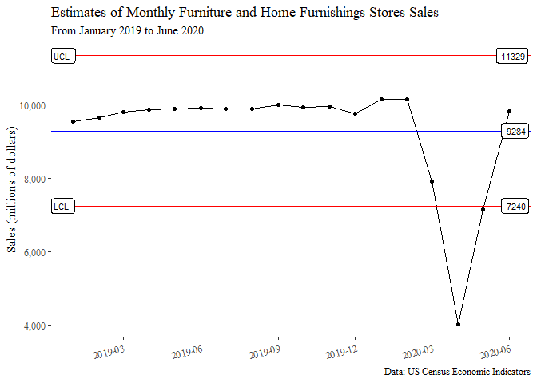

Monthly Retail Sales for Furniture and Home Furnishings Stores Across
the US
================
Jin Chen
8/15/2020

# Purpose

1.  Practice using ggQC to make quality control charts (aka process
    behavior charts)
2.  Use Monthly Retail Trade data from the US Census and practice
    calling from the census api.

Process behavior charts is arguably the [“single best tool for business
analysis”](https://www.daveondata.com/blog/process-behavior-charts-the-business-analysis-tool/).
It provides an objective way to determine whether business fluctuations
are concerning or within variation limits.

Since I don’t have direct access to actual sales data, I can use the
next best thing, the US Census. Since the 1950s, the Census has
collected monthly surveys from businesses in the retail industry which
estimates sales numbers by sector. I can further drill down to specific
sub-sectors of the industry. [The data can be found
here](https://www.census.gov/retail/index.html).

For this project I’ll be using the censusapi package to collect Monthly
Retail Sales data from the Furniture and Home Furnishings sub-sector
using the census API. The documentation for the [MRTS table can be found
here](https://api.census.gov/data/timeseries/eits.html).

``` r
library(tidyverse) 
library(censusapi) #for data
library(ggplot2)
library(ggQC) #for quality control charts
library(ggthemes)
```

# Content

Importing the data from the census api. I use only adjusted values and
filter for values from January 2019 to June 2020.

``` r
# Add key to .Renviron
# Reload .Renviron
readRenviron("~/.Renviron")
# Check to see that the expected key is output in your R console
Sys.getenv("CENSUS_KEY")

#check the list of APIs that the censusapi package offers
apis <- listCensusApis()
view(apis)

#check the list of variables in the Monthly Retail Sales API
mrts_vars <- listCensusMetadata(name = "timeseries/eits/mrts",
                                type = "variables")

#In the MRTS API, we can only use data from the entire US, there is no capability to drill down by state.
listCensusMetadata(name = "timeseries/eits/mrts",
                   type = "geography")

#make a list of variables that are required so we don't have to manually type it in. This package has graciously created a function for that. 
myvars <- makeVarlist("timeseries/eits/mrts", find = "required variables")

#get the data, categor_code refers to the Furniture and Home furnishings sector
mrts_data <- getCensus(name = "timeseries/eits/mrts",
          vars = myvars,
          region = "us",
          category_code = 442, 
          time = "from 2010 to 2020"
          )

#use only adjusted data. Adjusted data removes the effects of recurring seasonal influences
mrts_data_filtered <- mrts_data %>% 
  filter(data_type_code == "SM",
         seasonally_adj == "yes") %>% 
  select(cell_value, time_slot_date) %>% 
  mutate(cell_value = as.numeric(cell_value),
         date = as.Date(time_slot_date))

#only use data since January 2019
mrts_data_19 <- mrts_data_filtered %>% 
  filter(date >= "2019-01-01")
```

# Formatting

Using the ggQC package, I can now graph the control chart.

``` r
ggplot(mrts_data_19, aes(x = date, y = cell_value)) +
  geom_point() +
  geom_line() +
  stat_QC(method = "XmR",
          auto.label = TRUE,
          label.digits = 0,
          show.1n2.sigma = FALSE) +
  scale_x_date(date_breaks = "3 month", date_labels = "%Y-%m") +
  theme_tufte() +
  theme(axis.text.x = element_text(angle = 15, hjust = 1)) +
  scale_y_continuous(label=scales::comma) +
  labs(x = NULL,
       y = "Sales (millions of dollars)",
       title = "Estimates of Monthly Furniture and Home Furnishings Stores Sales",
       subtitle = "From January 2019 to June 2020",
       caption = "Data: US Census Economic Indicators")
```

<!-- -->

# Results

First, lets go over how to read the results of our control chart.
Control charts offer more extensive analysis beyond a simple graph of
time series and sales numbers. It tells us whether or not our process is
“in control”. Is the picture telling me that everything is ok and I can
relax or something is up and I need to find out what has happened?

I see that most values up until early 2020 is hovering around the
average indicated by the blue line. The UCL and LCL are the upper and
lower control limits. These essentially represent “guardrails”. Any
point above the UCL represents sales going way above our normal sales
numbers. If there were points there, we could ask if we recently
intiated a new marketing campaign, changed products or prices, or
implemented a new strategy. In my graph today, we don’t have any points
above the UCL so I can move on.

Points below the LCL should be investigated. Beginning in early 2020,
sales began plummeting in this industry and eventually hit a low of
around $4 billion dollars. It began recovering significantly about a
move afterwards, but didn’t fully reach the average until about June
2020.

I can hypothesize that since COVID-19 hit in early 2020 and peaked
around the April - May time period at the same time that sales numbers
went down, we can infer that the pandemic had a tremendous impact on the
home furnishing industry. The estimated monthly sales across the US
dropped from an average of $9.3 billion to a low of $4 billion and has
been recovering since June 2020.

# Reflections

I had a ton of fun learning about quality control charts and its
potential use for analysis. I can further expand on my knowledge by
learning more about the indepth usages of control charts. For example,
the differences between the R, U, C and np charts and when to use each.
Furthermore, there is also a list of 8 rules of control charts that
recognize patterns beyond investigating points that are outside our
control limits.

I had great practice using the census api, there is a lot of data that
is collected. I did have to spend a significant amount of time learning
the censusapi package and looking through the census api documentation.

For future iterations of this project, it would be interesting to
implement the plotly package to make this chart interactive.
