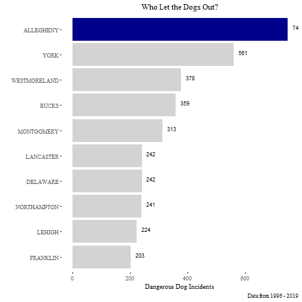

#Purpose
To answer the question "Which county has the most dangerous dog incidents in PA?" by analyzing a dataset from the Pennsylvania government on dangerous dog incidents from 1996 to 2019.

#Content
I will use the RSocrata package to import the data.


```r
library(tidyverse)
library(ggplot2)
library(RSocrata)
library(ggthemes)
library(ezknitr)

ezknit(file = "R/dan_dogs.Rmd", out_dir = "outputs/", keep_html = FALSE, fig_dir = "figures")
```

```
## Error in parse_block(g[-1], g[1], params.src, markdown_mode): Duplicate chunk label 'Dangerous Dog Incidents Graph', which has been used for the chunk:
## #by county
## p <- ggplot(data = dan_dogs_county,
##             mapping = aes(x = county,
##                           y = count))
## p + geom_col(aes(fill = county_highlight)) +
##     coord_flip() +
##     theme_tufte() +
##     theme(legend.position = "none") +
##     scale_fill_manual(values = c("dark blue", "light grey")) +
##     labs(title = "Who Let the Dogs Out?",
##        caption = "Data from 1996 - 2019",
##        y = "Dangerous Dog Incidents",
##        x = "") +
##     theme(plot.title = element_text(hjust = 0.5)) +
##     geom_text(aes(label = count), vjust = 0, hjust = -0.5, size = 3)
```

```r
#set the public URL for the data set 
url <- "https://data.pa.gov/Public-Safety/Dangerous-Dogs-1996-Current-County-Agriculture/3fcn-e5dk"

#call the API using RSocrata
dan_dogs_raw <- read.socrata(url)

#show the first few obs
head(dan_dogs_raw)
```

```
##    file_date determination_year status_description county_description dog_info_age dog_info_breed dog_info_predator
## 1 2003-06-16               2003           Deceased               YORK       3 YRS.        UNKNOWN               Dog
## 2 2003-06-16               2003           Deceased               YORK       6 YRS.        UNKNOWN               Dog
## 3 2003-05-22               2003           Deceased          ARMSTRONG       4 YRS.        UNKNOWN               Dog
## 4 2003-08-18               2003           Deceased            CAMBRIA      UNKNOWN        UNKNOWN               Dog
## 5 2003-01-01               2003             Closed              BUCKS      UNKNOWN        UNKNOWN               Dog
## 6 2003-01-01               2003             Closed            CHESTER        ADULT        UNKNOWN               Dog
##   county_key owner_county court_disposition hearing_date owner_first_name owner_last_name                owner_address
## 1         67         YORK            Guilty   2003-06-16       GENE/DONNA  HOSTLER/KINERT 1300 YORK HAVEN ROAD, LOT 79
## 2         67         YORK            Guilty   2003-06-16       GENE/DONNA  HOSTLER/KINERT 1300 YORK HAVEN ROAD, LOT 79
## 3          3    ARMSTRONG            Guilty   2003-05-22           RONALD       DZUROUCIN             278 PHILIPS LANE
## 4         11      CAMBRIA            Guilty   2003-08-18            TERRY       MELL, SR.          1147 DEVEAUX STREET
## 5          9        BUCKS            Guilty   2003-08-20           ALISON         CUSATIS              1293 LISA DRIVE
## 6         15      CHESTER             Other         <NA>              LUC        D'AURIOL         2545 WHITEHORSE ROAD
##   owner_city  owner_state owner_zip pa_dept_of_ag_dog_law_region   account_last_first_names   account_first_last_name
## 1 YORK HAVEN Pennsylvania     17370                            6 HOSTLER/KINERT, GENE/DONNA GENE/DONNA HOSTLER/KINERT
## 2 YORK HAVEN Pennsylvania     17370                            6 HOSTLER/KINERT, GENE/DONNA GENE/DONNA HOSTLER/KINERT
## 3  LEECHBURG Pennsylvania     15656                            1          DZUROUCIN, RONALD          RONALD DZUROUCIN
## 4     ELMORA Pennsylvania     15737                            4           MELL, SR., TERRY           TERRY MELL, SR.
## 5 WARRINGTON Pennsylvania     18976                            7            CUSATIS, ALISON            ALISON CUSATIS
## 6     BERWYN Pennsylvania     19312                            7              D'AURIOL, LUC              LUC D'AURIOL
##   business_name                                      full_address address_line_2 middle_name
## 1          <NA> 1300 YORK HAVEN ROAD, LOT 79\nYORK HAVEN PA 17370                           
## 2          <NA> 1300 YORK HAVEN ROAD, LOT 79\nYORK HAVEN PA 17370                           
## 3          <NA>              278 PHILIPS LANE\nLEECHBURG PA 15656                           
## 4          <NA>              1147 DEVEAUX STREET\nELMORA PA 15737                           
## 5          <NA>              1293 LISA DRIVE\nWARRINGTON PA 18976                           
## 6          <NA>             2545 WHITEHORSE ROAD\nBERWYN PA 19312                           
##                geocoded_column
## 1 POINT (-76.751687 40.124895)
## 2 POINT (-76.751687 40.124895)
## 3 POINT (-79.652105 40.609562)
## 4 POINT (-78.750988 40.605271)
## 5 POINT (-75.128722 40.246242)
## 6 POINT (-75.450961 40.002585)
```

#Structure
I create a separate df from the raw data. I rename a column to make it more accessible. Then I find the count of incidents that happened in each county. 


```r
#by county
dan_dogs_county <- dan_dogs_raw %>% 
  rename(county = county_description) %>% 
  mutate( year = lubridate::year(file_date)) %>% #create a year column
  filter(year != 2020) %>% #filter out entries with year of 2020
  group_by(county) %>% 
  summarize(count = n()) %>% #count the number of incidents in each county
  select(county, count) %>% 
  mutate(county = fct_reorder(county, count)) %>%  #order county by count for graphing purposes
  arrange(desc(count)) %>% 
  top_n(10)
```

```
## Selecting by count
```

```r
#Create a column to distinguish the #1 county of incidents with the rest. (could use gghighlight as an alternative)
dan_dogs_county <- dan_dogs_county %>% 
  mutate(county_highlight =
           ifelse(county == "ALLEGHENY",
                  "Allegheny",
                  "Other Counties"))
```
#Formatting

```r
#by county
p <- ggplot(data = dan_dogs_county,
            mapping = aes(x = county,
                          y = count))
p + geom_col(aes(fill = county_highlight)) +
    coord_flip() +
    theme_tufte() +
    theme(legend.position = "none") +
    scale_fill_manual(values = c("dark blue", "light grey")) +
    labs(title = "Who Let the Dogs Out?",
       caption = "Data from 1996 - 2019",
       y = "Dangerous Dog Incidents",
       x = "") +
    theme(plot.title = element_text(hjust = 0.5)) +
    geom_text(aes(label = count), vjust = 0, hjust = -0.5, size = 3)
```


#Conclusion

Thus conclude today's daily data visualization! We have found that the PA county with the most dangerous dog incidents is Allegheny followed by York and Westmoreland with Bucks closely behind. 


